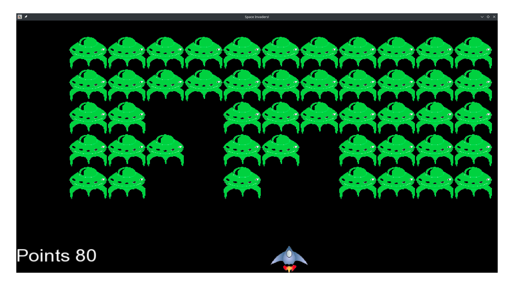

# Space Invaders

Space Invaders is 2D game created using C++ and SFML library, in which aliens rain down from the sky and a ship controlled by the player shoots them down for points. The game finally ends when the fleet of aliens manages to reach the floor of the window.

This was my first programming project, done for fun. It isn't interesting to play.

The only external dependency is SFML.

## Controls:
1. left and right arrow keys to move left and right
2. space key to shoot

## Steps to Build

1. Install SFML. On Fedora, this is done through the following command:
    
    > sudo dnf install SFML-devel

2. Clone the repository:

    i. click the "clone" button and copy the link

    ii. cd to wherever you like on your system

    iii. type:
    
    > git clone [link you copied] si

3. Build the project. First, enter the repository using "cd". Then, type:
    > make

4. [optional] Clean up the object files' mess by typing:
    > make clean

5. Run the game by typing:
    > ./SI

## Contributing:

Any minor tweaks that make the game better are great, such as:
1. changing speed of the ship
2. getting a new kind of bullet that takes out multiple ships at a time
3. improving this README
4. coding a better background
5. getting better images for sprites

Bigger pieces of work, like change in gameplay rules, would be great too.